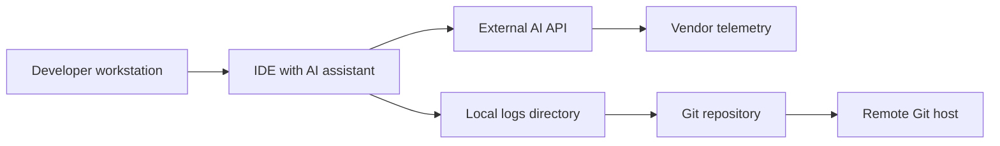

# Security and Privacy Recommendations for AI Tools and External Services

Status: Adopted  
Owner: Security Lead  
Last updated: 2025-09-29  
Audience: Engineers, Security, Compliance, DevOps

---

## Executive Summary

An incident was identified where the Qwen Code IDE assistant (Alibaba) logged sensitive fingerprinting and contextual data from local development workflows, including:

- Session identifiers and prompt identifiers
- Hostname Dawestation
- Platform and kernel information
- Node.js runtime version
- Full conversation history

Scope and resolution:

- 37 JSON log files were identified and removed from the local `logs/openai/` directory.
- The logs were produced by an external AI tool (Qwen Code), not the website codebase.
- The `logs/` directory is correctly ignored by `.gitignore`, minimizing risk of accidental commit.
- No application code changes were required; remediation focused on tooling configuration and hygiene.

Impact:

- Exposure was local to the development environment. Risk would materially increase if such logs were synced or uploaded to a remote origin, vendor, or backup.
- Primary risk categories: developer fingerprinting, internal system metadata disclosure, prompt content leakage, potential inclusion of API tokens or secrets if ever present in context.

Lessons learned:

- IDE-based AI tools may silently generate telemetry or logs by default.
- Local log files can accumulate sensitive artifacts and should be actively prevented, monitored, and purged.
- Vendor selection and configuration must explicitly consider logging, retention, and training defaults.

---

## Data Flow Context



Risk points:

- Logs: Local plaintext files or rotating JSON logs can capture identifiers and context.
- Vendor telemetry: Default analytics or training pipelines may store prompts and metadata.
- Git history: Accidental addition of logs or secrets creates durable exposure.

---

## 1) Incident Summary and Resolution

- Tool: Qwen Code IDE assistant (Alibaba)
- What was logged: session IDs, prompt IDs, hostname Dawestation, platform/kernel, Node.js version, full conversation history
- Where: Local directory `logs/openai/` (37 files)
- Root cause: Default or permissive logging from an external AI tool
- Resolution:
  - Removed all identified log files
  - Confirmed `logs/` is ignored by `.gitignore`
  - Verified no app code contributed to logging and no code changes were needed
- Post-incident actions:
  - Documented prevention standards (this document)
  - Added guidance to evaluate and configure AI tools with log-off policies
  - Instituted monitoring and auditing recommendations below

---

## 2) Best Practices for AI Tool Privacy and Security

Policy baseline:

- Default-deny logging: All AI tools and plugins must have logging disabled unless explicitly required for time-bound debugging.
- Data minimization: Do not provide non-public data to AI tools unless strictly necessary and approved.
- Secrets hygiene: Never paste secrets or tokens into prompts. Use redaction and secret scanning.
- Explicit consent for telemetry: Do not enable vendor telemetry or model training without a documented DPA and business approval.

Actionable controls:

- Configuration
  - Disable local logging and telemetry in every AI/IDE assistant setting.
  - Opt out of model training and prompt retention where possible.
  - Prefer offline or privacy-preserving modes; disable automatic context sweeping across files.
- Redaction and minimization
  - Redact identifiers: session IDs, hostnames, internal URLs, DB URIs, API tokens, customer data.
  - Use synthetic or masked examples in prompts for debugging.
- Secrets and tokens
  - Manage credentials in a vault; never embed in prompts, logs, or source.
  - Use short-lived and scoped tokens for any development integrations.
- Environment hygiene
  - Keep `logs/`, `traces/`, `cache/` and similar paths ignored in VCS.
  - Periodically purge temp and cache directories for AI tools.
- Device and network
  - Restrict plugin file-system access to the current project wherever possible.
  - Enforce outbound egress controls and DNS allowlists for dev workstations where feasible.

---

## 3) Vendor and Third-Party AI Tool Evaluation Checklist

Use this checklist before adopting or enabling any AI tool, SDK, or plugin:

Security and privacy

- Data retention: What is retained, for how long, and where
- Training usage: Prompts/outputs excluded from training and model improvement by default
- Regionality: Data residency options and EU/UK adequacy where applicable
- Encryption: TLS in transit; encryption at rest; key management posture
- Access controls: SSO, MFA, SCIM provisioning, RBAC, tenant isolation
- Audit logs: Availability of detailed customer audit logs
- Breach handling: Contractual breach notification windows and playbooks
- Subprocessors: Transparent list with DPAs and regional scopes
- Deletion: Verified data deletion and customer-initiated purge mechanisms
- No-log mode: Per-request headers or flags to prevent vendor logging
- On-device modes: Support for local inference or privacy-preserving gateways

Compliance and assurance

- Certifications: SOC 2 Type II, ISO 27001, or equivalent
- Penetration testing: Regular independent testing with summary reports
- DPA/BAA: Signed agreements aligned with regulatory needs
- Purpose limitation: Contractual limits on data use beyond service delivery

Product controls

- Logging controls: Ability to fully disable local and remote logs
- Redaction: Built-in redaction of secrets and identifiers
- Versioning: Transparent release notes for privacy-impacting changes
- Support SLAs: Clear path to disable or remove telemetry

Adoption decision

- Risk score: Aggregate security, privacy, and compliance considerations
- Exceptions: Any deviation from baseline must be risk-accepted and time-bound

---

## 4) Monitoring and Prevention Strategies

Local prevention

- VCS hygiene
  - Ensure `logs/`, binary artifacts, and caches are permanently ignored.
  - Add commit hooks to block addition of log or trace files.
- Secret scanning
  - Enable pre-commit and CI secret scanning with multiple engines to reduce false negatives.
- File system monitoring
  - Watch for file creation in sensitive paths such as `logs/`, `trace/`, `cache/`, `.qwen/`, `.vscode/`.
  - Alert and auto-purge patterns that match sensitive content if justified by policy.

Illustrative examples:

Pre-commit hooks (conceptual)

```yaml
repos:
  - repo: https://github.com/zricethezav/gitleaks
    rev: v8.18.4
    hooks:
      - id: gitleaks
  - repo: https://github.com/Yelp/detect-secrets
    rev: v1.4.0
    hooks:
      - id: detect-secrets
  - repo: local
    hooks:
      - id: block-ai-logs
        name: Block AI tool logs
        entry: bash -c 'if git diff --cached --name-only | grep -E "^logs/|\\.log$|\\.trace$|\\.jsonl$"; then echo "Blocking commit: log or trace files must not be committed"; exit 1; fi'
        language: system
        types: [file]
        stages: [commit]
```

Inotify-based local watch (Linux)

```bash
inotifywait -m -r -e create,modify,move --format "%e %w%f" logs/ \
  | while read ev path; do
      printf "[ai-log-watch] %s %s\n" "$ev" "$path"
    done
```

CI hard gates

- Deny merges if scans detect secrets, identifiers, or artifacts under `logs/`.
- Periodically scan full Git history for sensitive patterns after large refactors.

Network and host controls

- Use workstation egress policies to prevent unauthorized endpoints.
- Prefer dev containers or VMs to sandbox plugins and reduce host exposure.

Centralized LLM gateway optional pattern

- Route AI traffic through a privacy gateway capable of redaction, policy enforcement, and audit logging.
- Enforce no-log flags at the gateway and strip identifiers from payloads.

---

## 5) Regular Security Audit Recommendations

Cadence

- Monthly: Local workstation audit for stray logs, caches, and temp files related to AI tools.
- Quarterly: Vendor posture review, re-validate DPAs, review product changes to logging or training defaults.
- Quarterly: CI policy validation, secret scanner efficacy review, false positive tuning.
- Annually: Program review, tabletop exercises for AI data leakage, update standards to match evolving tools.

Audit checklist

- Verify `logs/` and similar paths are ignored and remain untracked.
- Sample developer machines for AI tool directories and caches.
- Confirm secret scanners are enabled pre-commit and in CI on all repos.
- Review AI plugin inventories across IDEs; remove unused or non-compliant tools.
- Validate vendor audit logs availability and retention.
- Confirm incident response runbook is current and accessible.

---

## Operational Runbook: If Sensitive Logging Is Detected

1. Triage and containment
   - Isolate affected machine; stop the tool; prevent further logging.
   - Capture a minimal forensic snapshot if required by policy.
2. Eradication
   - Remove local logs and caches following secure deletion guidance.
   - Verify `.gitignore` and ensure nothing reached VCS.
   - Rotate any possibly exposed tokens or credentials.
3. Recovery
   - Re-enable tooling with hardened configuration: logging off, telemetry/training off.
   - Validate secret scanners and hooks are active and enforced.
4. Notification and learning
   - Record timeline and root cause in the incident tracker.
   - Notify stakeholders per the communications plan if impact thresholds are met.
   - Update this document, checklists, and vendor evaluations if gaps were found.

---

## Quick Reference: Do and Do Not

Do

- Disable local and vendor logging by default for AI tools
- Redact identifiers, secrets, and internal URLs from prompts
- Keep `logs/` and caches ignored and periodically purged
- Use pre-commit and CI secret scanning
- Prefer vendors with enforceable no-log and no-train options

Do not

- Paste API keys, tokens, or customer data into prompts
- Enable telemetry or training without explicit agreements
- Allow AI tools unrestricted filesystem or network access
- Commit any log, trace, or cache files to source control

---

## Appendix: Context from Resolved Incident

- Affected files: 37 JSON logs in `logs/openai/`
- Hostname present in logs: Dawestation
- Data types observed: session IDs, prompt IDs, platform/kernel, Node.js version, conversation content
- Source: External tool Qwen Code, not website codebase
- Controls present: `.gitignore` ignores `logs/`
- Outcome: Logs removed; no code changes required; program-level controls strengthened via this guidance

---
